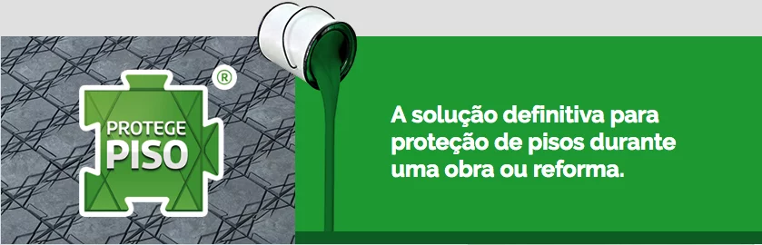

<!--  -->

## A Protege Piso

É uma empresa inovadora dedicada a fornecer soluções de proteção de pisos altamente eficazes para uma variedade de necessidades na construção civil e empreendimentos imobiliários.  
Com um compromisso inflexível com a qualidade, durabilidade e praticidade, nossa empresa se destaca como líder no setor, oferecendo produtos e serviços que atendem às demandas mais exigentes de nossos clientes.  
Nossa linha de produtos é o resultado de anos de pesquisa, desenvolvimento e aprimoramento contínuo, garantindo que cada solução oferecida pela Protege Piso seja da mais alta qualidade e atenda aos mais altos padrões de desempenho.  
Nosso sistema de proteção de pisos é especialmente projetado para resistir a impactos, abrasão e condições climáticas adversas, proporcionando uma camada robusta de defesa para qualquer piso, desde canteiros de obras até ambientes industriais.

## Missão, Visão e Valores
- Tecnologia e Inovação
- Compromisso com a Qualidade:
- Responsabilidade Social e Ambiental

## Saiba mais sobre a Protege Piso

### Resistência
O sistema Protege Piso tem capacidade de resistir às ocorrências que sua obra exige.

### Aqui não tem improviso, tem proteção!
O verso da placa possui tecnologia de absorção de impacto. São detalhes que ampliam a segurança na sua obra.

Protege Piso é o único sistema de proteção para pisos com desempenho garantido para áreas externas, internas e pisos de madeira.

### Instalação
Solução completa, transporte, mão de obra, instalação, manutenção e retirada do sistema é totalmente executado pela Protege Piso sem custos extras.  
*A proteção do seu piso é nossa responsabilidade.*

### Sistema de locação por m²
O sistema de proteção é alugado. Mais economia para sua obra e sustentabilidade ambiental.

### Garantia ilimitada que só a Protege Piso tem
Protegemos e mantemos seu piso protegido, um compromisso com o resultado. Antecipe o cronograma da sua obra e deixe a proteção de seu piso conosco!

### Inovação e qualidade
* Cuidamos de toda sua obra, conheça nossa linha de soluções: *  
- Bancadas;  
- Louças sanitárias;  
- Metais;  
- Banheiras;  
- Móveis;  
- De 15 anos de experiência.  

### Descubra como tornarmos sua obra mais segura
<iframe width="640" height="360" src="https://www.youtube.com/embed/6VydtOBK_qQ" frameborder="0" allowfullscreen></iframe>

<!--  -->
<!--  -->
<!--  -->
